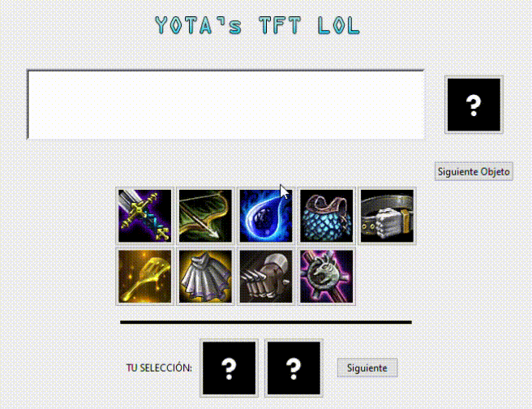

# TFT-LoL-aprender-objetos
Aprender objetos y sus combinaciones en League of Legends TFT.

Este programa está compuesto de "aprenderCombinacionesTFT.py", un programa a través de la terminal que genera tests de objetos y acepta inputs del usuario. E "Interfaz Gráfica.py" que hace lo mismo pero a través de una interfaz.

La clase "combinaciones.py" sirve para albergar los métodos y la propia creación de los Objetos. La clase "funcionesInterfaz.py" sirve como back end de la interfaz gráfica.

Añadir en el futuro:
1)Notebook en la interfaz gráfica.
2)Clase y origen de campeones.
3)Anotaciones en el código para su fácil lectura.

GIF de la interfaz gráfica:

